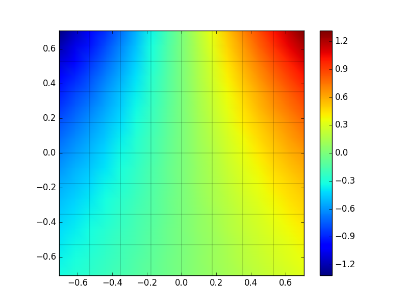
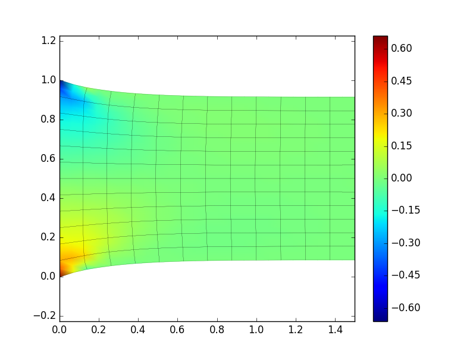
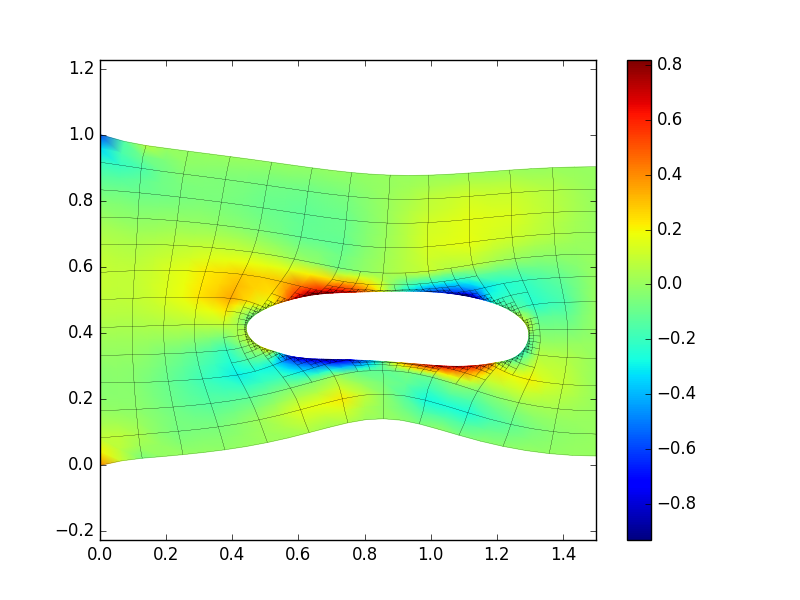

About Nutils
============

[Nutils] is a python based finite element package.  Nutils does not come with a
GUI.  You have to write a python script yourself.  Nutils provides a set of
tools help you implement a weak formulation quite easily.

Some basic understanding of python is useful.  If you are unfamiliar with python
you might want to browser through a [tutorial][Python tutorial].

[Nutils]: http://www.nutils.org/
[Python tutorial]: https://docs.python.org/3/tutorial/index.html

Einstein notation
=================

All mathematical equations in this document are written using the [Einstein
Notation].  All indices of vectors, matrices or higher-dimensional arrays are
explicitly listed.  The following special cases apply:

*   Indices following a comma denote derivatives:
    $$
        u
         i,jk
    $$
    is equivalent to
    $$
         2
        ∂ u
           i
        ------
        ∂x ∂x
          j  k
    $$

*   Repeated indices in a term are summed:
    $$
        u    + v  w
         ,ii    j  ,j
    $$
    is equivalent to
    $$
            2
           ∂ u         ∂w
        ∑  --- + ∑  v  ---
         i   2    j  j ∂x
           ∂x            j
             i
    $$

[Einstein notation]: https://en.wikipedia.org/wiki/Einstein_notation

Laplace's equation with Neumann BC's
====================================

Consider the following system ([Laplace's equation] with homogeneous Neumann
boundary conditions):
$$
    { & -u    = 0    & "on " Ω,  .
    {     ,kk                    .
    {                            .
    { & u   n  = 0   & "on " ∂Ω, .
    {    ,k  k                   .
$$
with $n$ the outward normal and domain $Ω = [-1/\sqrt{2},1/\sqrt{2}]^2$.
Note that this system is singular.

[Laplace's equation]: https://en.wikipedia.org/wiki/Laplace%27s_equation

Let $φ: Ω → ℝ^N$ a basis on domain $Ω$.  A weak formulation of this system
reads:

>   Find $w_j$ such that for all $i ∈ \{0,1,\ldots, N-1\}$
>   $$
>       ∫  φ    φ    w  \ dΩ = 0.
>        Ω  i,k  j,k  j
>   $$

The solution $u$ is then approximated by $φ_j w_j$, i.e. the dot product of the
basis $φ$ with vector $w$.

Let $T$ be a structured partition of $8×8$ equally sized elements of $Ω$ and
$φ$ a linear basis on $T$.  The following Nutils script implements the weak
formulation and finds a solution:

    @include laplace_neumann_simple.py[2:]

Importing nutils
----------------

In this script the line

    from nutils import *

loads the python package `nutils`.  This line is mandatory for all nutils
scripts.  See the [python docs][python packages] for more information on
importing packages.

[python packages]: https://docs.python.org/3/tutorial/modules.html#packages

Topology and geometry
---------------------

With the line

    domain, geom = mesh.rectilinear([verts, verts])

we create a structured two-dimensional mesh.  The argument `[verts, verts]` of
function `mesh.rectilinear` specifies the vertices of the mesh per dimension,
i.e. `verts` in the first dimension and also `verts` in the second dimension.
`mesh.rectilinear([verts])` would create a one-dimensional mesh and
`mesh.rectilinear([verts, verts, verts])` a three-dimensional structured mesh.

The variable `verts` contains a list of vertices, e.g. `[0, 0.25, 0.5, 0.75,
1]`.  The function `numpy.linspace` creates a list of equally spaced numbers
between two end points, e.g. `numpy.linspace(0, 1, 5)` returns `[0, 0.25, 0.5
0.75, 1]`.  The first two arguments describe the two end points, the third
argument the number of points.  The number of elements corresponding to a list
of vertices is always the number of vertices minus one.

The function `mesh.rectilinear` returns a topology and a geometry object, in
the example respectively stored in variables `domain` and `geom`.  The topology
object contains information about the elements and the connectivity between the
elements, but no geometric information.  The geometry object is a Nutils
function that connects a topological coordinate to a geometric coordinate.  To
illustrate the difference the following example generates the same
one-dimensional topology twice, but with different geometry functions:

    verts1 = [0, 1, 2, 3, 4]
    domain1, geom1 = mesh.rectilinear([verts1])
    verts2 = [0, 0.25, 0.5, 0.75, 1]
    domain2, geom2 = mesh.rectilinear([verts2])

Basis
-----

With

    basis = domain.basis('spline', degree=1)

a linear basis is created on topology `domain` and stored in variable `basis`.
The first argument to `domain.basis` specifies the type of the basis, e.g.
`'spline'` for a spline basis or `'discont'` for a basis suitable for
discontinuous Galerking FEM.  The second argument specifies the degree of the
basis.

The Nutils function `basis`, like `geom`, can be 'evaluated' on the topology,
and returns a vector of length $N^2$, where $N$ is the number of basis
functions.  In the example script there are 91 basis functions, one per vertex
if the basis is linear.  The function attribute `shape` returns the shape of a
function.  For example `basis.shape` returns `(91,)` and `geom.shape` `(2,)`.

Numerical integration
---------------------

Every topology object has an `integrate` method that can integrate an integrand
(first argument) using a numerical scheme specified by the [keyword argument]
`ischeme` on a certain geometry specified by the keyword argument `geometry`.
The following python code evaluates the integral
$$
    A   = ∫  φ    φ    \ dΩ:
     ij    Ω  i,k  j,k
$$

    A = domain.integrate(
        basis['i,k'] * basis['j,k'],
        geometry=geom, ischeme='gauss3')

The `integrate` method generates a sparse matrix if the integrand has two
dimensions, i.e. two indices.  An integrand with only one index will result in
a vector.

The shape of the sparse matrix `A` is equal to the shape of the integrand.  In
this example `A.shape` equals `(basis['i,k'] * basis['j,k']).shape` equals
`(91, 91)`.

Matrices
--------

A sparse matrix has a `solve` method that solves linear problems of the form `A
x = b`, where `A` is the sparse matrix and `b` is the right hand side.  Passing
the right hand side as the first argument to `solve`, e.g. `A.solve(b)` yields
the solution `x`.  By default a sparse direct solver is used to solve the
linear system.  If the keyword argument `tol` is supplied, e.g.  `A.solve(b,
tol=1e-8)` the linear system is solved using GMRES.  If the keyword argument
`symmetric=True` is supplied, the linear system is solved using CG.  Note that
it is your responsibility to ensure the matrix is symmetric positive definite.
If the keyword argument `precon='spilu'` is supplied the iterative solver is
preconditioned with ILU.  By omitting the first (positional) argument the right
hand side is assumed to be zero.

Instead of using Nutils' sparse matrix class, you can extract a [scipy sparse]
matrix object by calling the matrix method `toscipy()`:

    B = A.toscipy()

[ILU]: https://en.wikipedia.org/wiki/Incomplete_LU_factorization
[keyword argument]: https://docs.python.org/3/tutorial/controlflow.html#keyword-arguments
[scipy sparse]: http://docs.scipy.org/doc/scipy-0.14.0/reference/sparse.html

Laplace's equation with Dirichlet BC's
======================================

We replace the homogeneous Neumann boundary conditions with Dirichlet boundary
conditions:
$$
    { & -u    = 0   & "on " Ω,  .
    {     ,kk                   .
    {                           .
    { & u = f       & "on " ∂Ω, .
$$
with function $f$ given by
$$
    f(x) = \sin(x ) \exp(x ).
                 0        1
$$
This system is not singular.  Note that the solution to this problem is $u =
f$.

A weak formulation of this system reads:

>   Find $w_j$ such that for all $i ∈ \{0, 1, \ldots, N-1\}$ for which $φ_i$
>   has *no* support on the boundary $∂Ω$
>   $$
>       ∫  φ    φ    w  \ dΩ = 0,
>        Ω  i,k  j,k  j
>   $$
>   and such that for all $i ∈ \{0, 1, \ldots, N-1\}$ for which $φ_i$ *has*
>   support on the boundary $∂Ω$
>   $$
>       ∫   φ  ( φ  w  - f ) \ dΩ = 0.                   (@pure-dirichlet-cons)
>        ∂Ω  i (  j  j     )
>   $$

The solution $u$ is again approximated by $φ_j w_j$.  Note that Equation
$\eqref{pure-dirichlet-cons}$ is an $L_2$-projection of $f$ onto basis $φ_i$
limited to the boundary $∂Ω$.

Again, let $T$ be a structured partition of $8×8$ equally sized elements of $Ω$
and $φ$ a linear basis on $T$.  The following Nutils script implements the weak
formulation and finds a solution:

    @include laplace_dirichlet_simple.py[2:]

Dirichlet constraints
---------------------

We explain the differences with the previous script.  We create a function `f`
by calling `function.sin` on the first component of the two-dimensional
geometry and `function.exp` on the second component:

    x0, x1 = geom
    f = function.sin(x0) * function.exp(x1)

The statement `x0, x1 = geom` unpacks the two components of the function
`geom`.

The dirichlet constraint $\eqref{pure-dirichlet-cons}$ is applied in the
following two statements:

    cons = domain.boundary.project(
        f, onto=basis, geometry=geom, ischeme='gauss3')
    w = A.solve(constrain=cons)

The first statement projects the function `f` onto `basis` limited to the
boundary of `domain`.  The `domain.boundary` is actually another topology
object, which supports the `integrate` and `project` methods.  The result
vector `cons` contains values for all basis functions that have support on
`domain.boundary`, otherwise `float('nan')`.

The method `solve` of a Nutils matrix supports an additional keyword argument
`constrain`.  If supplied, all values, i.e. those that are not `float('nan')`,
are copied to the solution vector and the remainder is solved.

To illustrate what happens, consider the linear system $A_{ij} x_j = b_j$ and
let $i_{\text{U}}$ be an index belonging to the unconstrained set and
$i_{\text{C}}$ to the constrained set and let $c_{j_{\text{C}}}$ be the vector
of constrains.  Let $\tilde x$ be the solution to the constrained problem.
Then we have $\tilde x_{j_{\text{C}}} = c_{j_{\text{C}}}$ and
$$
    A         {\tilde x}     = b     - A         c    .
     i   j              j       i       i   j     j
      "U" "U"            "U"     "U"     "U" "C"   "C"
$$

Note that $A_{ij} \tilde x_j ≠ b_j$!

Nutils' log
===========

Nutils creates html log files of your simulations.  By default the logs are
stored in the folder `public_html` in your home directory.  The file `log.html`
in this directory points to the latest simulation.

The following script models the same problem as discussed above, but supports
log files:

    @include laplace_dirichlet.py[2:]

The log of this simulation:
[laplace_dirichlet.py](logs/laplace_dirichlet.py/log.html).

The solution:

We explain the differences with the previous script.  All statements of the
previous script excluding the `import` statement are put into the function
`main`:

    def main(nelems=8, degree=1):

        ... # contents previous script plus plotting

    if __name__ == '__main__':
        util.run(main)

You can run this script by typing

    :::bash
    python3 laplace_dirichlet.py

in a shell.  The arguments `nelems` and `degree` can be specified on the
command line, e.g.

    :::bash
    python3 laplace_dirichlet.py --nelems=16 --degree=2

runs the script with variables `nelems` set to `16` and `degree` to `2`.

The statement

    u = basis.dot(w)

creates a solution function, the equivalent of $u = φ_i w_i$ where $φ_i$ is the
basis.

The function `domain.elem_eval` evaluates Nutils functions specified via the
first (positional) argument at several points on the topology and the function
`plt.mesh` plots the results, where the first argument defines a position and
the second a colour value.

Laplace's equation with mixed BC's
==================================

We partially replace the Dirichlet boundary conditions with Neumann boundary
conditions:
$$
    { & -u    = 0         & "on " Ω,    .
    {     ,kk                           .
    {                                   .
    { & u = f             & "on " Γ   , .
    {                              "d"  .
    {                                   .
    { & u   n  = f   n    & "on " Γ   , .
    {    ,k  k    ,k  k            "n"  .
$$
with $Γ_{\text{d}}$ the left and bottom side of $Ω$ and $Γ_{\text{n}}$ the top
and right side of $Ω$.  Note that the solution to this problem is $u = f$, the
same as for the problem with purely Dirichlet boundary conditions.

A weak formulation of this system reads:

>   Find $w_j$ such that for all $i ∈ \{0, 1, \ldots, N-1\}$ for which $φ_i$
>   has *no* support on $Γ_{\text{d}}$
>   $$
>       ∫  φ    φ    w  \ dΩ = ∫     φ  f   n  \ dΓ,        (@mixed-neumann-bc)
>        Ω  i,k  j,k  j         Γ     i  ,k  k
>                                "n"
>   $$
>   and such that for all $i ∈ \{0, 1, \ldots, N-1\}$ for which $φ_i$ *has*
>   support on $Γ_{\text{d}}$
>   $$
>       ∫     φ  ( φ  w  - f ) \ dΓ = 0.
>        Γ     i (  j  j     )
>         "d"
>   $$

Again, let $T$ be a structured partition of $8×8$ equally sized elements of $Ω$
and $φ$ a linear basis on $T$.  The following snippet shows the differences
between the script for purely Dirichlet boundary conditions with the present
case:

    @include laplace_mixed.py[20:33]

The log of this simulation: [laplace_mixed.py](logs/laplace_mixed.py/log.html).

The solution:

Since we are applying Dirichlet boundary conditions only on the left and bottom
side of the domain, we have updated the projection of `f` as follows:

    # construct dirichlet boundary constraints
    cons = domain.boundary['left,bottom'].project(
        f, onto=basis, geometry=geom, ischeme=ischeme)

The expression `domain['left,bottom']` generates a subtopology of the boundary
of `domain` limited to the left and bottom side.

The Neumann boundary condition, the left hand side of
$\eqref{mixed-neumann-bc}$ is implemented as follows:

    # construct right hand side
    n = geom.normal()
    b = domain.boundary['right,top'].integrate(
        basis['i'] * f[',k'] * n['k'],
        geometry=geom, ischeme=ischeme)

The function `geom.normal()` returns a Nutils function that represents the
normal of the geometry at a domain or element boundary.

Circular geometry
=================

So far we have been using square domains.  The strict separation between
topology and geometry might have looked unnecessarily  complex.  However, it
allows us to generate a different geometry on a structured topology quite
easily.  For the sake of argument let's apply the same problem with mixed
boundary conditions on a circular domain:
$$
              {      2           2   1 }
    Ω       = { x ∈ ℝ  \ :\ \|x\|  < - }.
     "circ"   {                  2   2 }
$$

We can create a mapping $g : Ω → Ω_{\text{circ}}$ by
$$
             { & \sin(x ) \cos(x )   & "if " i = 0, .
             {         0        1                   .
    g  : x ↦ {                                      .      (@map-square-circle)
     i       { & \cos(x ) \sin(x )   & "if " i = 1, .
             {         0        1                   .
$$

In the Nutils script the only difference with the previous script is the
definitions of the geometry.  We create a structured topology and geometry as
before and redefine `geom` using $\eqref{map-square-circle}$:

    @include laplace_mixed_circle.py[8:13]

The log of this simulation:
[laplace_mixed_circle.py](logs/laplace_mixed_circle.py/log.html).

The solution:

Unsteady heat equation
======================

Next, we consider the unsteady [heat equation] with homogeneous Dirichlet
boundary conditions:
$$
    { & u   - α u    = 0        & "on " Ω,     .
    {    ,t      ,kk                           .
    {                                          .
    { & u = 0                   & "on " ∂Ω,    .
    {                                          .
    {       1   1                              .
    { & u = - + - \tanh(c l)    & "at " t = 0, .
    {       2   2                              .
$$
with domain $Ω = [0, 1]^2$, $c$ a scalar and $l$ the following level set
function:
$$
    l(x) = \max{l (x), l (x)},
               { 1      2   }
$$
with
$$
                   (                       )
    l (x) = 0.15 - (|0.3 - x | + |0.4 - x |),
     1             (|       0|   |       1|)
$$
and
$$
                                   2             2
    l (x) = 0.15 - \sqrt{|0.7 - x |  + |0.6 - x | }.
     2                   |       0|    |       1|
$$
The level set function $l_1$ describes a square centred at $(0.3, 0.4)$ and
function $l_2$ a circle with radius $0.15$ centred at $(0.7, 0.6)$.  The
hyperbolic tangent is used to generated a smoothed heaviside of the level set
$l$, with smoothness controlled by parameter $c$.

A weak formulation of this system with the [Crank–Nicolson method] applied for
the temporal part reads:

>   Let matrix $A$ be given by
>   $$
>                (1          α          )
>       A   = ∫  (-- φ  φ  + - φ    φ   ) \ dΩ,
>        ij    Ω (∆t  i  j   2  i,k  j,k)
>   $$
>   and $B$ by
>   $$
>                (1          α          )
>       B   = ∫  (-- φ  φ  - - φ    φ   ) \ dΩ.
>        ij    Ω (∆t  i  j   2  i,k  j,k)
>   $$
>   Given the solution at time step $n$, $w_j^{(n)}$, find $w_j^{(n+1)}$ such
>   that for all $i ∈ \{0, 1, \ldots, N-1\}$ for which $φ_i$ has *no* support on
>   the boundary $∂Ω$
>   $$
>            (n+1)        (n)
>       A   w      = B   w   ,
>        ij  j        ij  j
>   $$
>   and such that for all $i ∈ \{0, 1, \ldots, N-1\}$ for which $φ_i$ *has*
>   support on the boundary $∂Ω$
>   $$
>              (     (n+1)     )
>       ∫   φ  ( φ  w      - 0 ) \ dΩ = 0.
>        ∂Ω  i (  j  j         )
>   $$

Note that matrices $A$ and $B$ do not depend on the time step $n$.

Let $T$ be a structured partition of $64×64$ equally sized elements of $Ω$ and
$φ$ a second order basis on $T$.  The following Nutils script implements the
weak formulation and finds a solution from $t=0$ to $t=1$ in hundred steps:

    @include heat.py[2:]

The log of this simulation: [heat.py](logs/heat.py/log.html).

The solution:

<video controls>
    <source src='logs/heat.py/temperature.mp4' type='video/mp4'/>
</video>

[heat equation]: https://en.wikipedia.org/wiki/Heat_equation
[Crank–Nicolson method]: https://en.wikipedia.org/wiki/Crank%E2%80%93Nicolson_method

Linear elasticity (to be completed)
===================================

All examples given above are scalar.  We end with an example of the
vector-valued steady [linear elasticity] equations:
$$
    { & σ     = 0    & "on " Ω ,                .
    {    ji,j                 0                 .
    {                                           .
    { & u  = 0       & "on " Γ      ,           .
    {    k                    "left"            .
    {                                           .
    {           1                               .               (@sys-lin-elas)
    { & u  n  = -    & "on " Γ                  .
    {    k  k   2             "right",          .
    {                                           .
    { & u   n  = 0   & "on " Γ     , Γ        , .
    {    ,k  k                "top"   "bottom"  .
$$
with the undisplaced domain $Ω_0 = [0, 1]^2$, $u$ a displacement, the stress
given by
$$
    σ   = λ ε   δ   + 2 μ ε  ,
     ij      kk  ij        ij
$$
and the strain by
$$
          1
    ε   = - (u    + u   ).
     ij   2 ( i,j    j,i)
$$
The displaced domain is given by
$$
    Ω = { x + u(x) \ :\ x  ∈ Ω  }.
        {                k    0 }
$$
The left boundary condition constrains the displacement to zero, the right
boundary condition constrains only the horizontal displacement to $0.5$, i.e.
the plate is stretched horizontally by $150%$.

[linear elasticity]: https://en.wikipedia.org/wiki/Linear_elasticity

Let $φ: Ω → ℝ^{N×2}$ a basis on domain $Ω$ and let $u$ be
$$
    u  = φ   w .
     k    jk  j
$$.
A weak formulation of system $\eqref{sys-lin-elas}$ reads:

>   Find $w_j$ such that for all $i ∈ \{0, 1, \ldots, N-1\}$ for which $φ_{i0}$
>   and $φ_{i1}$ have no support on $Γ_{\text{left}}$ and $φ_{ik} n_k$ has no
>   support on $Γ_{\text{right}}$
>   $$
>       ∫  φ     σ   w  \ dΩ = 0,
>        Ω  ik,l  jk  j
>   $$
>   such that for all $i ∈ \{0, 1, \ldots, N-1\}$ for which $φ_{i0}$ or $φ_{i1}$
>   has support on $Γ_{\text{left}}$
>   $$
>       ∫   φ   ( φ   w  - f ) \ dΩ = 0.
>        ∂Ω  ik (  jk  j     )
>   $$
>   and such that for all $i ∈ \{0, 1, \ldots, N-1\}$ for which $φ_{ik} n_k$
>   has support on $Γ_{\text{right}}$
>   $$
>                        (             1 )
>       ∫         φ   n  ( φ   n  w  - - ) \ dΩ = 0.
>        Γ         ik  k (  jl  l  j   2 )
>         "right"
>   $$

The Nutils equivalent:

    @include linear_elasticity.py[2:]

The log of this simulation: [linear_elasticity.py](logs/linear_elasticity.py/log.html).

Vector basis
------------

In order to create a vector basis you can use the `vector` method of a scalar
basis:

    dbasis = domain.basis('spline', degree=degree).vector(2)

The single argument to `vector` defines the length if the vector.  The resuling
basis has two axes: a dofs axis of size $n*k$ and an axis of size $k$, where
$n$ is the length of the scalar basis and $k$ is the vector length.

Combining constraints
---------------------

Multiple constraints can be 'combined' with the or operator `|`:

    cons = cons1 | cons2 | cons3

You should make sure that the separate constraints do not overlap!

Linear elasticity with a hole
=============================

Finally, we apply the linear elasticity problem defined above on a unit square
domain with a hole centred at $(0.6, 0.4)$ with radius $0.2$.  In Nutils we can
create a mesh for this domain be 'trimming' a structured mesh based on a level
set:

    @include linear_elasticity_with_hole.py[6:15]

The method `trim` of a topology takes a level set as first argument and a
maximum refinement level as second argument.  The `trim` method subdivides
elements where the level set changes sign until the maximum level of refinement
is reached and removes elements where the level set is negative.  Creating a
basis on a trimmed topology will actually create a basis on the original,
untrimmed topology.

The log of this simulation:
[linear_elasticity_with_hole.py](logs/linear_elasticity_with_hole.py/log.html).

The solution:

Stress in a bone fragment
-------------------------

The following video further illustrates the trim method.  The video shows the
stress in a bone fragment when the fragment is stretched vertically, modelled
by linear elasticity.

<video controls>
    <source
        src='http://mefd02.wtb.tue.nl/~gertjan/results/bone3d/bone.mp4'
        type='video/mp4'
    />
</video>

Publication:
C.V. Verhoosel, G.J. van Zwieten, B. van Rietbergen, R. de Borst,
Image-based goal-oriented adaptive isogeometric analysis with application
to the micro-mechanical modeling of trabecular bone,
Computational Methods in Applied Mechanical Engineering 284: 138–164, 2015,
[doi: 10.1016/j.cma.2014.07.009](http://dx.doi.org/10.1016/j.cma.2014.07.009).

Installation
============

Nutils requires python3 (version 3.3 or higher) with modules 'numpy', 'scipy'
and 'matplotlib'.  If this is already installed on your computer together with
'pip', you can install nutils by running

    :::bash
    pip3 install --user https://github.com/nutils/nutils/archive/master.zip

If not, see the platform specific installation instructions below.

Python source files can be edited using any (source code) editor, but you might
want to consider [Spyder].  The installation instructions below include Spyder.

[Spyder]: https://github.com/spyder-ide/spyder/

Linux
-----

Open a terminal and run

    :::bash
    wget https://repo.continuum.io/miniconda/Miniconda3-latest-Linux-x86_64.sh
    bash Miniconda3-latest-Linux-x86_64.sh -b -f "$HOME/miniconda3"
    export PATH="$HOME/miniconda3/bin:$PATH"
    echo '# add conda to PATH' >> "$HOME/.bashrc"
    echo 'export PATH="$HOME/miniconda3/bin:$PATH"' >> "$HOME/.bashrc"
    conda install -y pip numpy scipy matplotlib spyder
    pip install https://github.com/nutils/nutils/archive/master.zip

OS X
----

Open a terminal and run

    :::bash
    wget https://repo.continuum.io/miniconda/Miniconda3-latest-MacOSX-x86_64.sh
    bash Miniconda3-latest-MacOSX-x86_64.sh -b -f "$HOME/miniconda3"
    export PATH="$HOME/miniconda3/bin:$PATH"
    echo '# add conda to PATH' >> "$HOME/.bashrc"
    echo 'export PATH="$HOME/miniconda3/bin:$PATH"' >> "$HOME/.bashrc"
    conda install -y pip numpy scipy matplotlib spyder
    pip install https://github.com/nutils/nutils/archive/master.zip

Windows
-------

Install [WinPython] 3.4 or 3.5.  Open a WinPython command prompt and run

    :::bash
    pip install https://github.com/nutils/nutils/archive/master.zip

You might want to [register WinPython to Windows].

[WinPython]: http://winpython.github.io/
[register WinPython to Windows]: https://github.com/winpython/winpython/wiki/Installation#registration

Examples in this document
=========================

All the examples in this document can be found in the [nutils-by-example
repository] ([zip-file][nutils-by-example.zip]).

[nutils-by-example repository]: https://github.com/joostvanzwieten/nutils-by-example
[nutils-by-example.zip]: https://github.com/joostvanzwieten/nutils-by-example/archive/master.zip
